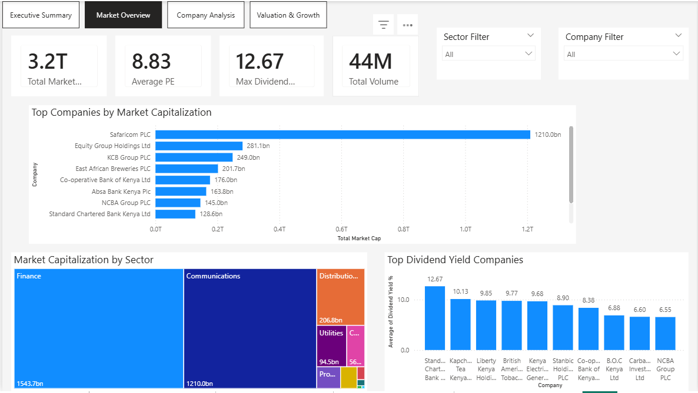

📊 Nairobi Securities Exchange (NSE) Market Performance Dashboard.

📌 Project Overview

This project analyzes the performance of **40 companies listed on the Nairobi Securities Exchange (NSE)** using financial indicators such as market capitalization, valuation ratios, dividend yield, trading volume, and earnings growth.

The objective of the dashboard is to provide **a clear view of market structure, company valuation, and investment opportunities** through interactive visualizations built in Power BI.

---

🎯 Business Problem

Investors and analysts often struggle to quickly understand **which companies dominate the market, which sectors drive growth, and which stocks may be undervalued or overvalued**.

Key Questions:

- Which companies dominate the NSE by market capitalization?
- Which sectors control the largest share of the market?
- Which stocks provide the highest dividend returns?
- Which companies show strong earnings growth relative to valuation?
- Which stocks are most actively traded?

---

🧹 Data Preparation
Prepared the dataset using Excel before importing into Power BI.

- Cleaned financial data and removed inconsistent formats
- Converted abbreviated values (K, M, B, T) into numeric values
- Structured dataset into a flat table suitable for Power BI
- Created calculated columns for market cap and trading volume
- Validated missing values for financial ratios

---

📐 Data Modeling
Data model designed to support financial analysis and visualization.

Fact Table: **NSE Companies Dataset**

Key variables included:

- Company Name
- Sector
- Market Capitalization
- Trading Volume
- P/E Ratio
- EPS
- EPS Growth %
- Dividend Yield %

Measures created using DAX:

- Total Market Capitalization
- Average P/E Ratio
- Maximum Dividend Yield
- Total Trading Volume

---

📊 Analytical Pages

### 1️⃣ Executive Summary
Provides a high-level overview of key insights derived from the market analysis.

Highlights:

- Market concentration across sectors
- Dividend income opportunities
- Valuation vs growth opportunities
- Trading activity insights

---

### 2️⃣ Market Overview
Key KPIs and macro-level market insights.

Total Market Capitalization  
Average Market P/E Ratio  
Maximum Dividend Yield  
Total Trading Volume  

Visualizations:

- Top Companies by Market Capitalization
- Sector Market Capitalization Distribution
- Top Dividend Yield Companies

---

### 3️⃣ Company Analysis
Compares company-level performance and investor activity.

Key Visualizations:

- Most Traded Companies
- Highest Valuation Companies (P/E Ratio)
- Top Earnings Growth Companies

---

### 4️⃣ Valuation & Growth Analysis
Analyzes company valuation relative to earnings growth.

Scatter plot analysis helps identify:

- High-growth companies
- Potential undervalued stocks
- Overvalued companies relative to earnings growth

---

🔍 Key Insights

- The NSE market is highly concentrated with **Safaricom PLC accounting for the largest market capitalization (~1.2T KES)**.
- The **Finance sector dominates the exchange** both in number of listed companies and market value.
- Several banking institutions demonstrate **strong dividend yields**, making them attractive income investments.
- The valuation vs growth analysis reveals **companies with strong earnings growth but moderate valuations**, indicating potential investment opportunities.
- Trading activity is concentrated among a **small number of highly liquid stocks**.

---

🛠 Tools Used

- Excel (Data Preparation & Cleaning)
- Power BI Desktop
- DAX
- Power Query
- Data Modeling
- Data Visualization & Financial Analysis

---
